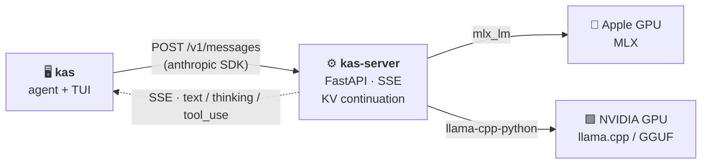
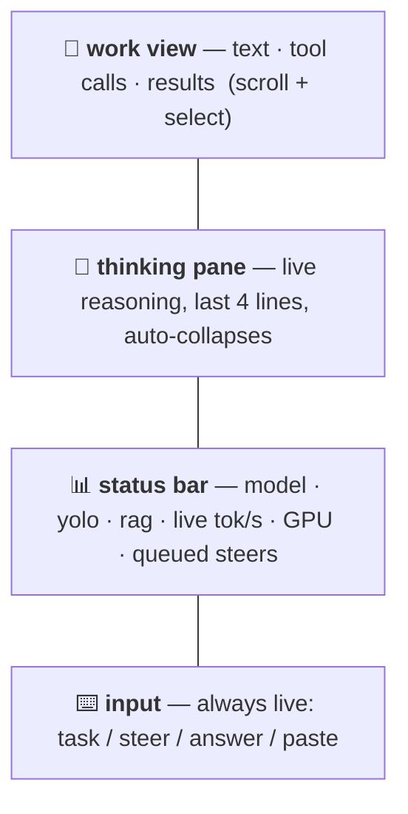

<p align="center">
  
</p>

<p align="center">
  
  
  
  
  
</p>

**K.A.S — Kasra's Agentic Shell.** Run frontier open models **locally** — on the
**Apple-silicon GPU** (via MLX) *or* an **NVIDIA GPU** (via llama.cpp/GGUF) —
behind an **Anthropic Messages API-compatible server**, and drive them with an
agentic TUI. 🔒 Nothing leaves the machine: tool use, streaming, thinking,
subagents, KV-cache continuation, local recall, and surgical edits, all on your
own iron.



🛠️ **Tools the model can call** — `bash` (PTY) · `read_file` · `write_file` ·
`edit_file` · `list_dir` · `subagent` · `recall` (local BM25, on by default) ·
`web_search` / `web_fetch` (opt-in, `--net`) · `generate_image` (local FLUX via
mflux, opt-in, `--art`).

## 🧰 Requirements

The server runs on **either** of two GPU backends — pick the row for your iron:

🍎 **Apple Silicon → MLX** (the primary, daily-driven path)

| | Minimum | Recommended |
|---|---|---|
| Machine | Apple Silicon (M-series) Mac | M2/M3/M4 Pro/Max/Ultra |
| macOS | 14 (Sonoma) | latest |
| Unified memory | **24 GB** (4-bit ≤ ~14B, tight) | **64 GB** (27B/MoE) · 128 GB (80B+) |
| Free disk | ~20 GB (one 4-bit model) | 100 GB+ (multiple models) |

🟩 **NVIDIA → llama.cpp / GGUF** (validated on an A100 — see [🟩 NVIDIA / CUDA](#-nvidia--cuda))

| | Minimum | Recommended |
|---|---|---|
| GPU | NVIDIA, CUDA 11.8+ driver, `nvidia-smi` on PATH | 24 GB+ VRAM (A100/H100/RTX) |
| VRAM | **16 GB** (4-bit ≤ ~14B) | **40 GB** (27–35B at long context) |
| OS | Linux x86-64 | — |

Both share: [uv](https://docs.astral.sh/uv/) (auto-installed) + Python 3.11
(uv-managed). The model is the memory driver — a 27B 4-bit GGUF/MLX is ~15–18 GB
of weights plus KV cache. The **agent alone** (`kas`, no local server) is fully
portable and needs no GPU — point it at a remote `--base-url`.

🩺 **On any host, run `kas doctor`** — it detects your OS / CPU arch / GPU vendor
and reports exactly what each optional feature needs (`kas doctor --install` sets
them up). See the [support matrix](#-platforms--support-matrix) and
[testing](#-tested-hardware--models) for what's been verified.

## ⚡ Install

**One command, no clone needed** — installs `kas` + `kas-server` as a
[uv](https://docs.astral.sh/uv/) tool (bootstraps uv + a pinned Python):

```sh
curl -fsSL https://raw.githubusercontent.com/quantumwake/kas/main/install.sh | sh
```

The installer is **GPU-aware**: on Apple Silicon it bundles MLX; on an NVIDIA box
it detects the GPU and sets up the CUDA llama.cpp backend for you (prebuilt wheel
fast-path, ~10 s — or a source build if needed). 🟩 NVIDIA details
[below](#-nvidia--cuda). (From a local checkout, `./install.sh` or `make install`
does an editable install.)

### 🧩 Features — one installer

Optional features (voice, vision, image-gen, memory, web, …) are **not** in the
core install. There is **one** way to add them, used by every path:

```sh
kas doctor
kas doctor --install
```

`kas doctor` reports what's available and installed on your host; `kas doctor
--install` walks you through installing the features that work here and persists
the choice.

You can also add a single feature in the TUI — `/listen install` (voice),
`/image install` (vision), `/memory install`, `/say install`, `/show install` —
which runs the *same* installer for that one feature.

**It's consistent and additive:** every installer writes your chosen set to
`~/.kascode/features.json` and reinstalls the kas tool with the **complete** set,
so a new feature never drops an old one, and the set **survives `make install`**
and re-`curl`s. The first install bundles a light default (voice + memory +
preview + web on Apple Silicon); `kas doctor --install` adds the heavier
vision/tts/image-gen runtimes.

Some features also need a native tool — **ffmpeg** (voice capture), **pngpaste**
(macOS clipboard images), **espeak-ng** (Linux TTS); `kas doctor` prints the
exact `brew`/`apt`/`dnf` command. Every feature degrades gracefully with a hint
if its package is absent.

### 🧹 Uninstall

Drop a single feature (one of `voice`, `tts`, `art`, `vision`, `memory`, `web`,
`preview`):

```sh
kas doctor --remove vision
```

Remove kas entirely:

```sh
curl -fsSL https://raw.githubusercontent.com/quantumwake/kas/main/uninstall.sh | sh
```

From a local checkout, `make uninstall` does the same; set `KAS_PURGE=1` to also
drop `~/.kascode`. Uninstall removes the tool only — your config under
`~/.kascode` and downloaded model weights under `~/.cache/huggingface` are left
in place (the script prints how to remove them).

## 🚀 Quick start

```sh
kas serve
kas
```

`kas serve` starts the inference server (a daemon that loads the model); `kas`
launches the agent TUI. For a one-shot, fully autonomous run:

```sh
kas --yolo "build me an asteroids game in ./game, then run it"
```

`kas serve` backgrounds itself and waits until the model is ready. Manage it
with `kas serve --status | --stop | --logs`, or run it in the foreground with
`kas serve --no-daemon` (equivalently, `kas-server`).

If you just run `kas` and no server is up, it offers to start one for you
(`Start one now? [Y/n]`), then lets you pick from your downloaded models (with
sizes) or type any Hugging Face model id to load — so the two-step above
collapses to a single command on a local box. It only offers for a local
`--base-url`; a remote one is left to you.

## 🖥️ The TUI

Stacked regions, amber on black:



- **Steer while it works** — keep typing; messages inject at the next tool
  boundary. `Esc` (or `/stop`) interrupts now, keeps partial output, applies it.
- **Pause/resume** — `Ctrl-P` (or `/pause`) saves and exits at a safe point;
  `kas --resume` picks the task back up and continues automatically.
- **Confirmations** — `y` / `N` / `a`=always (yolo for the rest of the session).
- **Multiline paste** — pasted blocks are staged and attached to your next
  message (type an instruction, or just Enter).
- **Select + copy** — drag-select the work view, `Ctrl-C` copies (`Ctrl-Q` quits).
- **Subagents** — when the agent delegates, `/subagents` lists them (with
  status) and `/subagent <n>` opens a scrollable view of what that one is doing
  (`Esc` closes it). The parent sizes each subagent's round budget by task.
- **Context window** — `/ctx` shows window / usage / compaction policy;
  `/ctx <n|max|auto>` sets when to compact (`max` rides up to the hard limit).
- **Ambient fx bar** — distinct animation *per state* so "working" is obvious:
  idle drifts calmly through colourful palettes, generating races, tools march;
  `/fx <effect|auto|on|off|list>` to drive it.
- **Themes** — `/theme <amber|matrix|ice|fire|neon|synthwave|rainbow|purple|mono|auto>`
  recolours the **whole screen** (chrome + fx bar) live; `--theme <name>`
  (or `KAS_THEME`) sets it at startup.
- **Slash commands** (tab-complete on `/`): `/yolo` · `/rag enable|disable` ·
  `/ctx` · `/kv` · `/art` · `/fx` · `/theme` · `/subagents` · `/subagent <n>` ·
  `/model` (arrow-key picker, shows size + partial/full) · `/compact` ·
  `/self-skill` · `/stop` (Esc, also cancels a long prefill) · `/pause` · `/status`.

## 🎛️ Commands & flags

```text
kas [task...]              agent — interactive TUI, or one-shot if a task is given
kas serve                 start the inference server (daemon by default)
kas serve --model ID [--quant Q4_K_M]   load a model (GGUF quant optional)
kas serve --stop|--status|--logs|--no-daemon
kas-server                run the server in the foreground directly

--workdir DIR              working directory for tools           (default .)
--yolo                     run bash without per-command confirmation
--model ID                 model label (default: ask the server)
--quant NAME               GGUF quant to load (e.g. Q4_K_M); else auto-picked
--base-url URL             server URL              (default 127.0.0.1:8765)
--max-tokens N             output cap per response                  (16384)
--compact-at N             auto-compact past N input tokens        (120000)
--rag / --no-rag           local recall tool  (on by default; offline)
--net                      enable web_search / web_fetch  (off · needs 'web' extra)
--art                      enable generate_image (FLUX/MLX) (off · needs 'art' extra)
--checkpoint               per-turn git commits even in an existing repo
--resume [ID]              continue a saved session (latest if no id) — warm KV
--sessions                 list resumable sessions, then exit
--plain                    line REPL instead of the TUI
```

## 🔩 Under the hood

- **dialects** — auto-detects Gemma vs Qwen ChatML from the model's template;
  translates Anthropic tool-use ⇄ each model's native wire format.
- **continuation** — append-only KV reuse: agent turns prefill only the new
  tokens, not the whole transcript (≈ constant per-turn cost).
- **per-thread KV cache** — the main agent and each subagent get their own cache
  slot, so delegating doesn't reset the parent's cache.
- **subagents** — delegate a self-contained subtask to a fresh empty context;
  only the final report returns.
- **compaction** — triggers on the real symptom (decode tok/s falling below a
  threshold) with a context-overflow safety read from the model; the original
  transcript is archived to `.agent/sessions/<id>/compaction-NN.json`.
- **recall** (`--rag`, on by default) — local BM25 (sqlite FTS5) over code, docs,
  and past session memory, so compaction stays lossless. Complements grep;
  fully offline. (A hybrid vector half can layer on later.)
- **sessions** — every turn autosaved; `--resume` continues mid-task work.
- **warm resume** (`/kv`, on by default) — each thread's KV cache is persisted as
  incremental deltas under the session dir, so `--resume` rehydrates instead of
  cold-prefilling the whole transcript. Fail-safe (falls back to cold prefill);
  set `KAS_KV_PERSIST=0` to disable.
- **cancellable prefill** — `Esc` (`POST /v1/cancel`) stops an in-flight prefill
  immediately, not just between tokens — and frees the worker for a model swap.
- **checkpoints** (`--checkpoint`) — output dirs become git repos; every turn is
  a commit on a pre-agent baseline (git revert = undo a turn).
- **sandbox** — currently **disabled and gated**. A file-tools-only jail gave a
  false sense of security (it confined `read/write/edit` but `bash` escaped it),
  so it was removed; `--sandbox` exits with a notice. Real isolation is a future
  microVM-isolation extension. For now, tools run with your permissions — review
  what the agent runs (or run it against a remote/disposable host).
- **image generation** (`--art`) — `generate_image` renders PNGs with a local
  diffusion model (FLUX via mflux on the Apple GPU); the model writes the file
  and gets back a path (bytes never enter the token stream). Use a fixed `seed`
  + a shared style for consistent sprite sets.
- **hot-swap** — `/model [n]` (or `POST /v1/models/select`) swaps the served
  model live, no restart; the picker shows each model's size + partial/full.

## 🧠 Models

Default: `mlx-community/Qwen3.6-27B-4bit`. Switch live with `/model`, or
`make start MODEL=…`. On 128 GB, options include:

```text
  Qwen3.6-27B-4bit              ~15 GB   default · dense
  Qwen3.6-35B-A3B-4bit          ~15 GB   MoE (~3B active) · ~4x faster decode
  Qwen3-Next-80B-A3B-4bit       ~42 GB   bigger, same A3B speed class
  gpt-oss-120b (MXFP4)          ~60 GB   strong; harmony dialect supported
```

Tool calling is parsed per model family (qwen / llama / mistral / harmony /
hermes / deepseek / kimi / gemma) — see the **Models × dialect** table below.
The `/model` picker lists only chat-capable models (it classifies each cached
model by modality, hiding embedding/Whisper/diffusion weights).

## 🟩 NVIDIA / CUDA

Same agent, same API — just a different GPU under the server. On an NVIDIA box
the server runs **GGUF models through llama.cpp**, and the installer wires up the
CUDA build automatically.

**1. Install** (the curl installer detects the GPU and does this for you):

```sh
curl -fsSL https://raw.githubusercontent.com/quantumwake/kas/main/install.sh | sh
# tries abetlen's prebuilt CUDA wheel first (~10 s); else builds from source.
# verify it linked CUDA:  python -c "import llama_cpp, glob, pathlib as p; \
#   print(glob.glob(str(p.Path(llama_cpp.__file__).parent/'lib'/'*cuda*')))"
```

> ⚠️ A plain `pip install llama-cpp-python` is **CPU-only** — your GPU sits idle.
> Let the installer (or `python -m scripts.install_deps`) build the CUDA variant.
> Re-run the **installer**, not a bare pip, after any `kas` upgrade — a forced
> tool reinstall rebuilds the venv and would otherwise drop the CUDA wheel.

**2. Run** — point it at any Hugging Face GGUF repo:

```sh
kas serve --model unsloth/Qwen3.6-27B-MTP-GGUF      # auto-picks a 4-bit quant
kas serve --model unsloth/gemma-4-31B-it-qat-GGUF --quant Q4_K_M
kas                                                  # the agent, unchanged
```

**What kas handles for you on GGUF:**

- 📥 **Quant selection** — multi-quant repos are a zoo (`UD-Q4_K_M`, `Q4_K_XL`,
  `IQ4_XS`, split shards, mmproj/MTP files). kas auto-picks a sane 4-bit K-quant,
  logs the alternatives, and `--quant` pins one. mmproj/MTP files are skipped.
- 📏 **Context auto-sizing** — reads the model's trained length and uses as much
  as the GPU can hold, then **backs off** if the KV won't fit (no manual tuning).
  A dense 31B tops ~24 k on a 40 GB card; a hybrid 27B (mostly linear-attention
  layers) fits **128 k** on the same card. Override with `KAS_CTX` / `KAS_CTX_MAX`.
- ⚡ **Flash Attention on** by default (needed for sliding-window models like
  gemma; `KAS_FLASH_ATTN=0` to disable).
- 📊 **GPU in `/stats`** — live VRAM used/total + utilization via `nvidia-smi`.
- 🛟 **Never a dead turn** — if the KV fills mid-generation it ends the turn
  cleanly (continue to resume) instead of erroring.

ROCm (AMD) builds from the same path (`-DGGML_HIP=on`) but isn't tested yet —
[PRs welcome](#-platforms--support-matrix).

## ⚙️ Configuration (env)

```text
  KAS_MODEL          server model           (mlx-community/Qwen3.6-27B-4bit)
  KAS_BASE_URL       agent → server URL     (http://127.0.0.1:8765)
  KAS_PORT           server port            (8765)
  KAS_MAX_TOKENS     output cap             (16384)
  KAS_COMPACT_AT     auto-compaction        (120000 · 0 disables)
  KAS_COMPACT_TPS    compact below tok/s    (8.0 · 0 disables)
  KAS_KV_BITS        KV quantization        (8 · "" disables)
  KAS_KV_PERSIST     warm-resume KV to disk (on · =0 disables)
  KAS_MEMORY         =0 disables recall      (on by default)
  KAS_NET            =1 enables web tools    (off · kas is offline)
  KAS_ART            =1 enables generate_image (off · needs mflux)
  KAS_SANDBOX        =1 requests sandbox mode — gated (see --sandbox); off
  KAS_SUBAGENT_ROUNDS  default subagent round budget    (25 · cap 60)
  KAS_ART_MODEL      mflux model for --art  (flux2-klein-4b)
  KAS_ART_STYLE      style preamble prepended to every image prompt
  KAS_STT_MODEL      whisper model for /listen (mlx-community/whisper-large-v3-turbo)
  KAS_STT_DEVICE     mic input device for ffmpeg capture (":0" macOS · "default" linux)
  KAS_TTS            =mlx uses neural TTS (mlx-audio) instead of native say/espeak
  KAS_TTS_VOICE      native voice name for /say (e.g. a macOS `say` voice)
  KAS_IMAGE_INLINE   =1 base64-embed attached images (only for a REMOTE server)
```

🟩 **GGUF / NVIDIA backend** (llama.cpp path only):

```text
  KAS_GGUF_QUANT     quant to load, e.g. Q4_K_M   (--quant; else auto-picked)
  KAS_GGUF_FILE      exact GGUF filename/glob to load (power users)
  KAS_CTX            force the context window     (else sized to the model)
  KAS_CTX_MAX        ceiling for auto-sizing      (131072 · backoff fits the GPU)
  KAS_GPU_LAYERS     layers to offload to GPU     (-1 = all)
  KAS_FLASH_ATTN     =0 disables Flash Attention  (on · needed for SWA models)
  KAS_BACKEND        force a backend: mlx | llama_cpp   (else auto-detected)
```

## 🛠️ Make targets

```text
make start [MODEL=… PORT=…]   download (with progress) + boot server
make stop / restart / status / logs / perf
make test                     parser · protocol · continuation · cache · tools · compaction (no model)
make install                  install kas + kas-server to PATH
make doctor [ARGS=--install]  platform/GPU capability report + guided install
make download MODEL=…         fetch weights only
```

## 🌐 Platforms & support matrix

Run `kas doctor` on any machine for a live, platform-specific report of what's
installed and what each capability needs (`kas doctor --install` does it guided).

- **Agent (`kas`)** — portable. It only speaks HTTP to an Anthropic-compatible
  server, so it runs anywhere Python does (macOS, Linux, Windows).
- **Server (`kas-server`)** — **MLX** (Apple GPU) is the primary, daily-driven
  backend; the **llama.cpp/GGUF** backend (CPU + CUDA/ROCm/Metal) covers non-Apple
  hardware and is now **validated on NVIDIA** (A100 — see [🧪 testing](#-tested-hardware--models)).
- You can always point the agent at any other Anthropic-compatible endpoint
  (vLLM, TGI, LM Studio, …): `kas --base-url http://host:port`.

**Inference backend × platform** — ✅ tested · 🟡 implemented, lightly/untested · ⬜ planned

| Platform / accelerator | Backend | Status |
|---|---|---|
| macOS · Apple Silicon (Metal) | `mlx` | ✅ primary, daily use |
| 🟩 Linux · NVIDIA (CUDA) | `llama_cpp` (CUDA build) | ✅ tested — A100 40 GB (gemma-4-31B, Qwen3.6-27B) |
| Linux/macOS · CPU | `llama_cpp` (GGUF) | 🟡 CI smoke only (Qwen2.5-0.5B GGUF) |
| Linux · AMD (ROCm) | `llama_cpp` (ROCm build) | 🟡 builds, untested — **PRs welcome** |
| Windows | agent only → remote `--base-url` | 🟡 untested — **PRs welcome** |
| any · vLLM adapter | — | ⬜ planned (unlocks 100B+ on CUDA) |

**Models × tool-call dialect** (the agent needs the model's tool format parsed):

| Model family | Dialect | Status |
|---|---|---|
| Qwen3-Coder / Qwen3.6 | `qwen-xml` | ✅ live |
| Llama 3.1 / 3.2 / 3.3 | `llama-json` | ✅ live (Llama-3.2-3B) |
| Mistral / Mixtral | `mistral` | ✅ live (Mistral-7B-v0.3) |
| gpt-oss (harmony) | `harmony` | ✅ live (gpt-oss-20b) |
| Gemma 3/4 | `gemma` | ✅ live |
| Qwen2.5 / Qwen3-Next / Hermes | `hermes-json` | 🟡 unit-tested |
| DeepSeek V3 / R1 | `deepseek` | 🟡 unit-tested |
| Kimi-K2 | `kimi-k2` | 🟡 unit-tested |

Auto-detected from the chat template + model id; override per model in
`~/.kascode/dialects.json`.

**Feature × platform** (optional capabilities; the agent degrades gracefully):

| Feature | Command | Apple Silicon | Linux/Windows |
|---|---|---|---|
| Image → text (VLM) | drag-drop, `/image` | 🟡 mlx-vlm (needs live validation) | ⬜ |
| Voice → text | `/listen` | 🟡 mlx-whisper + ffmpeg | ⬜ |
| Text → image | `generate_image` | ✅ mflux (FLUX) | ⬜ |
| Image preview | `/show` | ✅ Pillow | ✅ Pillow |
| Text → voice | `/say` | ✅ native `say` · 🟡 mlx-audio | ✅ espeak-ng · ⬜ neural |
| Semantic recall | `/memory` | ✅ sqlite-vec | ✅ sqlite-vec |
| Web search/fetch | `--net` | ✅ | ✅ |

**Help us fill the grid.** The 🟡/⬜ cells are limited by the hardware we can
test on (this is Apple-Silicon-developed). If you run kas on NVIDIA, AMD, or a
Linux/Windows host — or live-validate a 🟡 cell — please open a PR with fixes or
a note confirming a combination works (model + platform + what you ran).
`kas doctor --json` output is a great thing to paste.

### Bring your own backend (Ollama, LM Studio, vLLM, …)

> **Disclaimer.** kas is built and dailied on Apple Silicon / MLX. Everything
> else is best-effort, and the backend layer is deliberately swappable so you
> can make it work on your stack. Fixes and new backends are very welcome —
> the bar is simply *that it works and presents the same interfaces*.

There are two integration depths:

1. **Cheapest — just point the agent at it.** Any server that speaks an
   Anthropic/OpenAI-compatible HTTP API already works: `kas --base-url
   http://host:port`. Ollama, LM Studio, vLLM, and TGI all qualify. You get
   inference; you do *not* get kas's KV-cache continuation, per-session KV
   threads, or `/v1/stats` token accounting — those live in `kas-server`.

2. **Native backend — implement the port.** To get the full feature set
   (append-only KV reuse, cancellable prefill, per-session caches, token
   counts), add an adapter under `server/backends/` and register it in the
   `BACKENDS` dict (`server/backends/__init__.py`). It must satisfy the
   `EngineLike` Protocol in [`server/core/ports.py`](server/core/ports.py):
   - **inference** — `tokenize()`, `encode()`, and a streaming `generate()`
     yielding `GenChunk`s, plus the `model_id` / `dialect` / `stats` attributes
     (this is the *minimum* — inference + token counts, as the matrix needs);
   - **management** — `swap()`, `request_cancel()`, `ping_status()`;
   - **optional** — `cache_snapshot()` / `rehydrate()` for KV-resume; backends
     that can't do it just omit them and callers degrade gracefully.

   Registration is gated by `supported()` (OS/arch) and `installed()` (package
   present), so an adapter that can't run on the current host is skipped rather
   than erroring — see how `mlx` and `llama_cpp` are wired.

An **Ollama or LM Studio native adapter** (wrapping their local API as an
`EngineLike`) is a great first PR. Note the honest trade-off in the other
direction: those tools currently parallelize multiple models / many concurrent
sessions better than kas does — kas's edge is the KV-cache continuation and
per-session KV threads. Improvements on either axis are welcome.

## 🧪 Tested hardware & models

What we've actually run end-to-end (load → tool-using generation), so you know
what's known-good vs. theoretical. ✅ full run · 🟡 loads/runs, lightly checked.

| GPU | Backend | Model | What ran |
|---|---|---|---|
| 🍎 Apple Silicon (M-series) | MLX | Qwen3.6-27B-4bit · gpt-oss-20b · Gemma 3/4 · Llama-3.2-3B · Mistral-7B | ✅ daily driver |
| 🟩 NVIDIA A100 40 GB | llama.cpp · CUDA | `Qwen3.6-27B-MTP-GGUF` (Q4_K_XL) @ **128 k ctx** | ✅ load + generate + thinking + `/stats` |
| 🟩 NVIDIA A100 40 GB | llama.cpp · CUDA | `gemma-4-31B-it-qat-GGUF` (Q4_K_XL) | ✅ load + generate + tool calls |
| 🟩 NVIDIA A100 40 GB | llama.cpp · CUDA | `Qwen-AgentWorld-35B-A3B-GGUF` (Q4_K_M) | 🟡 runs (user-driven) |
| 🟩 NVIDIA A100 40 GB | llama.cpp · CUDA | `GLM-5.2-GGUF` (Q4_K_M, split) | 🟡 quant/metadata only |
| 🖥️ Linux/macOS · CPU | llama.cpp | Qwen2.5-0.5B GGUF | ✅ CI smoke |

The NVIDIA bring-up surfaced a nice property: **hybrid** models (Qwen3.6 — only
16 of 64 layers are full-attention, the rest linear DeltaNet) have a tiny KV
cache and fit huge context, while **dense** 31B models (gemma-4) have a big KV
and the window auto-backs-off to fit. Ran a combo we don't list? A one-line PR
note (model + GPU + what you ran) is gold. ❤️

## 🩺 Troubleshooting & FAQ

<details><summary>🟩 <b>Loads, but my NVIDIA GPU is idle / it's on CPU</b></summary>

`llama-cpp-python` was built CPU-only. Re-run the **installer** (not bare pip) —
it builds the CUDA variant — then verify the lib is linked:

```sh
python -c "import llama_cpp, glob, pathlib as p; \
  print(glob.glob(str(p.Path(llama_cpp.__file__).parent/'lib'/'*cuda*')) or 'NO CUDA — rebuild')"
```

`uv` caches the built wheel by sdist hash and ignores `CMAKE_ARGS`, so a manual
rebuild needs `uv cache clean llama-cpp-python` first. `scripts/install_deps.py`
handles all of this.
</details>

<details><summary>💥 <b><code>api_error: llama_decode returned 1</code> / "ran for minutes then failed"</b></summary>

The context window filled (no free KV slot). This is fixed: the turn now ends
cleanly and you can just continue. The window is also auto-sized to the model now
(no more 16 k cap) — upgrade if you're on an older build.
</details>

<details><summary>📏 <b>"Only 16K context — this model handles way more"</b></summary>

Fixed — context is sized to the model's trained length and the GPU's free memory
(e.g. Qwen3.6-27B → 128 k on a 40 GB card). Force it with `KAS_CTX=N`, or raise/
lower the ceiling with `KAS_CTX_MAX`.
</details>

<details><summary>🧨 <b><code>Failed to create llama_context</code> on load</b></summary>

The KV cache for that context didn't fit VRAM. kas auto-backs-off the window, but
you can cap it directly: `KAS_CTX_MAX=32768 kas serve --model …`. Flash Attention
(on by default) is required for sliding-window models like gemma — don't set
`KAS_FLASH_ATTN=0` on those.
</details>

<details><summary>🔤 <b>Garbage output / control markers leak (<code>&lt;|im_end|&gt;</code>, <code>&lt;turn|&gt;</code>)</b></summary>

Both were GGUF-backend bugs (a missing BOS token; un-stopped scaffolding markers)
and are fixed — upgrade `kas`. If a new model leaks a marker, it's a dialect gap;
open an issue with the model id.
</details>

<details><summary>📥 <b>Which quant? / <code>No file found *Q4_K_M.gguf</code></b></summary>

Multi-quant repos vary wildly. kas auto-picks a 4-bit K-quant and logs the
alternatives on load — pin one with `--quant Q4_K_XL` (or `KAS_GGUF_QUANT`), or an
exact file with `KAS_GGUF_FILE`.
</details>

<details><summary>⏳ <b><code>kas serve</code> looks frozen on first load</b></summary>

It's downloading a multi-GB GGUF. The server now prints the live download/load
tail; `kas serve --logs` shows full progress. Big repos just take a while.
</details>

<details><summary>📊 <b><code>/stats</code> shows no GPU on NVIDIA</b></summary>

Needs `nvidia-smi` on PATH (ships with the driver). With it, `/stats` shows VRAM
used/total + utilization.
</details>

## 📂 Layout

Hexagonal (ports & adapters) — domain logic in `core/`, edges as `ports/`
Protocols, concrete I/O in `adapters/`. See
[`docs/architecture/REFACTOR-hexagonal.md`](docs/architecture/REFACTOR-hexagonal.md).

```text
server/app.py              composition root: FastAPI app, lifecycle, routes, state
server/cli.py              kas-server entry point
server/config.py           served model id · default token cap
server/engine.py           MLX worker thread · per-thread KV cache · quantization
server/core/               continuation memo · generate→events pipeline · cache math · ports
server/adapters/http/      Anthropic SSE framing · non-streaming aggregation
server/prompting/          Gemma/Qwen dialects · stream parser · translation · continuation tails

agent/cli.py               kas entry point: argparse, wiring, serve daemon
agent/config.py            env config · server probes
agent/core/                loop · compaction · prompts · tool schemas · transcript · subagent
agent/ports/               AgentIO · ToolExecutor Protocols
agent/adapters/ui/         ConsoleIO/Heartbeat · TUI
agent/adapters/tools/      ToolRunner · bash(PTY) · files(+sandbox) · web · recall
agent/adapters/retrieval/  local BM25 recall over code/docs/memory
agent/adapters/workspace/  per-turn git checkpoints
agent/adapters/storage/    session transcripts · compaction archives
```
