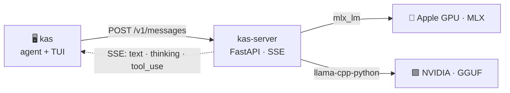

<p align="center">
  
</p>

<p align="center">
  <a href="https://github.com/quantumwake/kas/actions/workflows/ci.yml"></a>
  <a href="https://github.com/quantumwake/kas/actions/workflows/llama-cpp.yml"></a>
</p>

**K.A.S — Kasra's Agentic Shell.** Run open models **locally** — on Apple Silicon
(MLX) or NVIDIA (llama.cpp/GGUF) — behind an **Anthropic Messages-compatible
server**, driven by an agentic TUI. Offline, no telemetry: tool use, streaming,
thinking, subagents, KV-cache continuation, and local recall, all on your iron.



## Install

```sh
curl -fsSL https://raw.githubusercontent.com/quantumwake/kas/main/install.sh | sh
```

Installs `kas` + `kas-server` as a [uv](https://docs.astral.sh/uv/) tool. It's
**GPU-aware**: MLX on Apple Silicon, a CUDA llama.cpp build on NVIDIA (prebuilt
wheel, ~10 s). Optional features (voice, vision, image-gen, web) install via
`kas doctor --install`. Uninstall: `…/main/uninstall.sh | sh`.

## Quick start

```sh
kas serve          # start the inference server (loads the model)
kas                # launch the agent TUI

kas --yolo "build me an asteroids game in ./game, then run it"   # one-shot
```

If no server is up, `kas` offers to start one and pick a model. Manage the
daemon with `kas serve --status | --stop | --logs`. The agent alone is portable —
point it anywhere with `kas --base-url http://host:port`.

## NVIDIA / GGUF

Same agent, GGUF models through llama.cpp. Point `--model` at any Hugging Face
GGUF repo:

```sh
kas serve --model unsloth/Qwen3.6-27B-MTP-GGUF             # quant auto-picked
kas serve --model unsloth/gemma-4-31B-it-qat-GGUF --quant Q4_K_M
```

kas handles the GGUF rough edges for you: quant selection (`--quant` to pin),
context **auto-sized to the model + GPU** (a hybrid 27B fits 128 k on a 40 GB
card; a dense 31B backs off to fit), Flash Attention on, and live GPU memory in
`/stats`. Details in [`docs/backends.md`](docs/backends.md).

## Models

- 🍎 **MLX** — default `mlx-community/Qwen3.6-27B-4bit`; switch live with `/model`.
- 🟩 **GGUF** — any HF GGUF repo via `--model` (NVIDIA/CPU).

Tool calls are parsed per family (qwen · llama · mistral · harmony · hermes ·
deepseek · kimi · gemma), auto-detected from the chat template.

## Flags & config

```text
kas [task]                 interactive TUI, or one-shot if a task is given
  --yolo                   run bash without per-command confirmation
  --model ID --quant Q     pick a model (GGUF quant optional)
  --base-url URL           talk to a remote server (default 127.0.0.1:8765)
  --net / --art            enable web tools / image generation (opt-in)
  --resume [ID]            continue a saved session (warm KV)
kas serve --stop|--status|--logs|--no-daemon
```

Env vars mirror the flags (`KAS_MODEL`, `KAS_BASE_URL`, `KAS_MAX_TOKENS`, …).
GGUF tuning: `KAS_GGUF_QUANT`, `KAS_CTX` / `KAS_CTX_MAX`, `KAS_GPU_LAYERS`,
`KAS_FLASH_ATTN`, `KAS_BACKEND`. Run `kas doctor` for a capability report.

## What makes it tick

- **KV continuation** — agent turns prefill only the new tokens, not the whole
  transcript (≈ constant per-turn cost); persisted, so `--resume` rehydrates warm.
- **Per-thread caches + subagents** — the agent and each subagent get their own
  KV slot; delegate a subtask to a fresh context, only the report returns.
- **Compaction + recall** — compaction triggers on falling decode tok/s; local
  BM25 over code/docs/memory (`--rag`, offline) keeps it lossless.
- **Live + cancellable** — steer mid-task, `Esc` cancels even an in-flight
  prefill, `/model` hot-swaps the served model with no restart.

Architecture (hexagonal ports & adapters): [`docs/architecture/`](docs/architecture/).

## Tested

✅ run end-to-end · 🟡 runs, lightly checked

| GPU | Backend | Models |
|---|---|---|
| 🍎 Apple Silicon | MLX | ✅ Qwen3.6-27B · gpt-oss-20b · Gemma 3/4 · Llama-3.2 · Mistral-7B |
| 🟩 NVIDIA A100 40 GB | llama.cpp · CUDA | ✅ Qwen3.6-27B-MTP @ 128 k · gemma-4-31B · 🟡 Qwen-AgentWorld-35B, GLM-5.2 |
| 🖥️ Linux/macOS CPU | llama.cpp | ✅ Qwen2.5-0.5B (CI smoke) |

Ran a combo we don't list (NVIDIA, AMD/ROCm, …)? A one-line PR note is gold. ❤️

## Troubleshooting

<details><summary>NVIDIA GPU idle / running on CPU</summary>

`llama-cpp-python` was built CPU-only. Re-run the **installer** (not bare pip),
then check: `python -c "import llama_cpp,glob,pathlib as p; print(glob.glob(str(p.Path(llama_cpp.__file__).parent/'lib'/'*cuda*')) or 'NO CUDA')"`
</details>

<details><summary>Context feels small / <code>llama_decode returned 1</code></summary>

Fixed — context is auto-sized to the model and GPU (no flat cap), and a full KV
ends the turn cleanly so you can continue. Force it with `KAS_CTX` / `KAS_CTX_MAX`.
</details>

<details><summary><code>Failed to create llama_context</code> on load</summary>

The KV didn't fit VRAM; kas auto-backs-off, or cap it: `KAS_CTX_MAX=32768`. Keep
Flash Attention on for sliding-window models (gemma).
</details>

<details><summary>Garbage output / leaked markers (<code>&lt;|im_end|&gt;</code>, <code>&lt;turn|&gt;</code>)</summary>

GGUF-backend bugs, fixed — upgrade `kas`. A new model leaking a marker is a
dialect gap; open an issue with the model id.
</details>

## Other backends

Point the agent at any Anthropic/OpenAI-compatible server (Ollama, LM Studio,
vLLM, TGI): `kas --base-url http://host:port`. For the full feature set (KV
continuation, per-session caches), add an adapter under `server/backends/`
satisfying the `EngineLike` port in
[`server/core/ports.py`](server/core/ports.py). A native Ollama/LM Studio adapter
is a great first PR.
