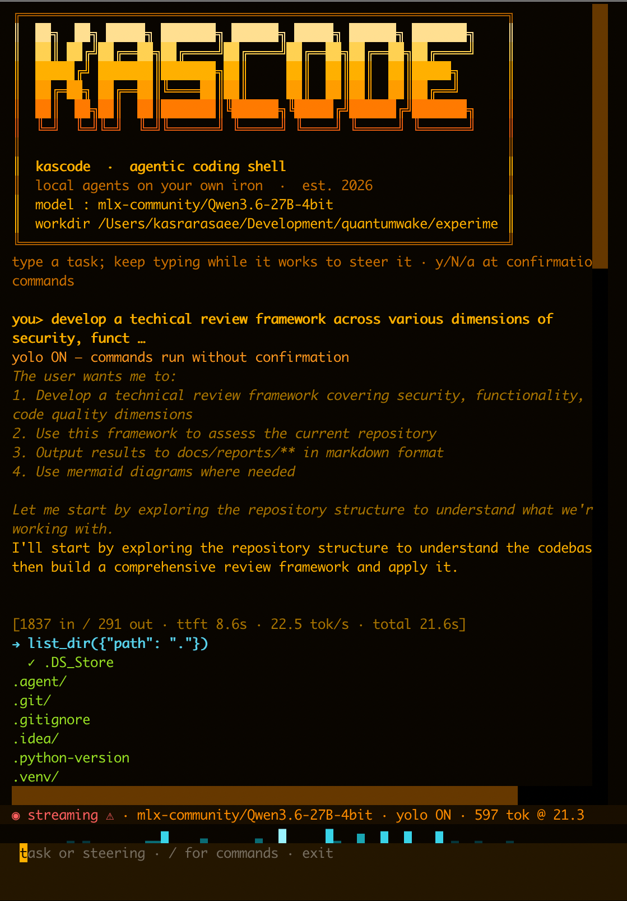

<p align="center">
  
</p>

<p align="center">
  
  
  
  
</p>

**K.A.S — Kasra's Agentic Shell.** Run frontier open models **locally** on the
Apple-silicon GPU (via MLX), behind an **Anthropic Messages API-compatible
server**, and drive them with an agentic TUI. Nothing leaves the machine — tool
use, streaming, thinking, subagents, KV-cache continuation, local recall, and
surgical edits, all on your own iron.

```text
┌──────────────┐   anthropic SDK    ┌──────────────┐    mlx_lm     ┌──────────┐
│  kas         │ ─────────────────▶ │  kas-server  │ ────────────▶ │  Qwen /  │
│  agent + TUI │  POST /v1/messages │ FastAPI · SSE │              │  Gemma   │
└──────────────┘ ◀───────────────── └──────────────┘               └──────────┘
       │  tool_use blocks                                          (Apple GPU)
       ▼
  bash(PTY) · read_file · write_file · edit_file · list_dir · subagent
  recall (local BM25, on by default) · web_search · web_fetch (opt-in, --net)
  generate_image (local FLUX via mflux, opt-in, --art)
```

## Requirements

| | Minimum | Recommended |
|---|---|---|
| Machine | Apple Silicon (M-series) Mac | M2/M3/M4 Pro/Max/Ultra |
| macOS | 14 (Sonoma) | latest |
| Unified memory | **24 GB** (4-bit ≤ ~14B, tight) | **64 GB** (27B/MoE) · 128 GB (80B+) |
| Free disk | ~20 GB (one 4-bit model) | 100 GB+ (multiple models) |
| Tooling | [uv](https://docs.astral.sh/uv/) (auto-installed); Python 3.11 (uv-managed) | — |

The model is the memory driver — `Qwen3.6-27B-4bit` (default) needs ~15 GB of
weights plus KV cache, so **32–64 GB** is the comfortable floor; smaller 4-bit
models run on 24 GB. The **agent alone** (`kas`, no local server) is portable
and has no GPU/RAM needs — point it at a remote `--base-url` (see Platforms).

## Install

Installs as the `kas` and `kas-server` commands via
[uv](https://docs.astral.sh/uv/):

```sh
git clone https://github.com/quantumwake/kascli && cd kascli
./install.sh                 # editable install to PATH  (or: make install)
```

Or, with repo access, a one-liner (bootstraps uv + installs from git):

```sh
curl -fsSL https://raw.githubusercontent.com/quantumwake/kascli/main/install.sh | sh
```

Opt-in tool backends are **optional extras** (the core install pulls neither):

```sh
uv add ddgs trafilatura     # web_search / web_fetch   (--net)   ·  extra: web
uv add mflux                # generate_image (FLUX/MLX) (--art)  ·  extra: art
```

Each tool degrades gracefully with an install hint if its package is absent.

## Quick start

```sh
kas serve            # start the inference server (daemon; loads the model)
kas                  # launch the agent TUI

# one-shot, fully autonomous:
kas --yolo "build me an asteroids game in ./game, then run it"
```

`kas serve` backgrounds itself and waits until the model is ready. Manage it
with `kas serve --status | --stop | --logs`, or run it in the foreground with
`kas serve --no-daemon` (equivalently, `kas-server`).

## The TUI

Three panels, amber on black:

```text
┌────────────────────────────────────────────────────────────┐
│  work view   · streamed thinking (dim) / text / tool calls   │  scroll + select
├────────────────────────────────────────────────────────────┤
│  status bar  · model · yolo · rag · live tok/s · queued steers│
├────────────────────────────────────────────────────────────┤
│ > _          · always live: task / steer / answer / paste     │
└────────────────────────────────────────────────────────────┘
```

- **Steer while it works** — keep typing; messages inject at the next tool
  boundary. `Esc` (or `/stop`) interrupts now, keeps partial output, applies it.
- **Pause/resume** — `Ctrl-P` (or `/pause`) saves and exits at a safe point;
  `kas --resume` picks the task back up and continues automatically.
- **Confirmations** — `y` / `N` / `a`=always (yolo for the rest of the session).
- **Multiline paste** — pasted blocks are staged and attached to your next
  message (type an instruction, or just Enter).
- **Select + copy** — drag-select the work view, `Ctrl-C` copies (`Ctrl-Q` quits).
- **Subagents** — when the agent delegates, `/subagents` lists them (with
  status) and `/subagent <n>` opens a scrollable view of what that one is doing
  (`Esc` closes it). The parent sizes each subagent's round budget by task.
- **Context window** — `/ctx` shows window / usage / compaction policy;
  `/ctx <n|max|auto>` sets when to compact (`max` rides up to the hard limit).
- **Ambient fx bar** — reacts to what the agent's doing (idle/prefill/generate/
  tools); `/fx <effect|auto|on|off|list>` to drive it.
- **Slash commands** (tab-complete on `/`): `/yolo` · `/rag enable|disable` ·
  `/ctx` · `/kv` · `/art` · `/fx` · `/subagents` · `/subagent <n>` ·
  `/model` (arrow-key picker, shows size + partial/full) · `/compact` ·
  `/stop` (Esc, also cancels a long prefill) · `/pause` · `/status`.

## Commands & flags

```text
kas [task...]              agent — interactive TUI, or one-shot if a task is given
kas serve                 start the inference server (daemon by default)
kas serve --stop|--status|--logs|--no-daemon
kas-server                run the server in the foreground directly

--workdir DIR              working directory for tools           (default .)
--yolo                     run bash without per-command confirmation
--model ID                 model label (default: ask the server)
--base-url URL             server URL              (default 127.0.0.1:8765)
--max-tokens N             output cap per response                  (16384)
--compact-at N             auto-compact past N input tokens        (120000)
--rag / --no-rag           local recall tool  (on by default; offline)
--net                      enable web_search / web_fetch  (off · needs 'web' extra)
--art                      enable generate_image (FLUX/MLX) (off · needs 'art' extra)
--sandbox                  jail file tools to the workdir (reject ../ + absolute escapes)
--checkpoint               per-turn git commits even in an existing repo
--resume [ID]              continue a saved session (latest if no id) — warm KV
--sessions                 list resumable sessions, then exit
--plain                    line REPL instead of the TUI
```

## Under the hood

- **dialects** — auto-detects Gemma vs Qwen ChatML from the model's template;
  translates Anthropic tool-use ⇄ each model's native wire format.
- **continuation** — append-only KV reuse: agent turns prefill only the new
  tokens, not the whole transcript (≈ constant per-turn cost).
- **per-thread KV cache** — the main agent and each subagent get their own cache
  slot, so delegating doesn't reset the parent's cache.
- **subagents** — delegate a self-contained subtask to a fresh empty context;
  only the final report returns.
- **compaction** — triggers on the real symptom (decode tok/s falling below a
  threshold) with a context-overflow safety read from the model; the original
  transcript is archived to `.agent/sessions/<id>/compaction-NN.json`.
- **recall** (`--rag`, on by default) — local BM25 (sqlite FTS5) over code, docs,
  and past session memory, so compaction stays lossless. Complements grep;
  fully offline. (A hybrid vector half can layer on later.)
- **sessions** — every turn autosaved; `--resume` continues mid-task work.
- **warm resume** (`/kv`, on by default) — each thread's KV cache is persisted as
  incremental deltas under the session dir, so `--resume` rehydrates instead of
  cold-prefilling the whole transcript. Fail-safe (falls back to cold prefill);
  set `KAS_KV_PERSIST=0` to disable.
- **cancellable prefill** — `Esc` (`POST /v1/cancel`) stops an in-flight prefill
  immediately, not just between tokens — and frees the worker for a model swap.
- **checkpoints** (`--checkpoint`) — output dirs become git repos; every turn is
  a commit on a pre-agent baseline (git revert = undo a turn).
- **sandbox** (`--sandbox`) — opt-in jail confining the file tools to the workdir
  (rejects absolute paths and `../` escapes); off by default.
- **image generation** (`--art`) — `generate_image` renders PNGs with a local
  diffusion model (FLUX via mflux on the Apple GPU); the model writes the file
  and gets back a path (bytes never enter the token stream). Use a fixed `seed`
  + a shared style for consistent sprite sets.
- **hot-swap** — `/model [n]` (or `POST /v1/models/select`) swaps the served
  model live, no restart; the picker shows each model's size + partial/full.

## Models

Default: `mlx-community/Qwen3.6-27B-4bit`. Switch live with `/model`, or
`make start MODEL=…`. On 128 GB, options include:

```text
  Qwen3.6-27B-4bit              ~15 GB   default · dense
  Qwen3.6-35B-A3B-4bit          ~15 GB   MoE (~3B active) · ~4x faster decode
  Qwen3-Next-80B-A3B-4bit       ~42 GB   bigger, same A3B speed class
  gpt-oss-120b (MXFP4)          ~60 GB   strong; needs a harmony dialect (todo)
```

## Configuration (env)

```text
  KAS_MODEL          server model           (mlx-community/Qwen3.6-27B-4bit)
  KAS_BASE_URL       agent → server URL     (http://127.0.0.1:8765)
  KAS_PORT           server port            (8765)
  KAS_MAX_TOKENS     output cap             (16384)
  KAS_COMPACT_AT     auto-compaction        (120000 · 0 disables)
  KAS_COMPACT_TPS    compact below tok/s    (8.0 · 0 disables)
  KAS_KV_BITS        KV quantization        (8 · "" disables)
  KAS_KV_PERSIST     warm-resume KV to disk (on · =0 disables)
  KAS_RAG            =0 disables recall      (on by default)
  KAS_NET            =1 enables web tools    (off · kas is offline)
  KAS_ART            =1 enables generate_image (off · needs mflux)
  KAS_SANDBOX        =1 jails file tools to the workdir (off)
  KAS_SUBAGENT_ROUNDS  default subagent round budget    (25 · cap 60)
  KAS_ART_MODEL      mflux model for --art  (flux2-klein-4b)
  KAS_ART_STYLE      style preamble prepended to every image prompt
```

## Make targets

```text
make start [MODEL=… PORT=…]   download (with progress) + boot server
make stop / restart / status / logs / perf
make test                     parser · protocol · continuation · cache · tools · compaction (no model)
make install                  install kas + kas-server to PATH
make download MODEL=…         fetch weights only
```

## Platforms

- **Agent (`kas`)** — portable. It only speaks HTTP to an Anthropic-compatible
  server, so it runs anywhere Python does (macOS, Linux, Windows).
- **Server (`kas-server`)** — **Apple-Silicon only today** (MLX = Apple GPU).
- **CUDA / ROCm / Windows** — works *now* by pointing the agent at any other
  Anthropic-compatible endpoint (vLLM, TGI, LM Studio, …):
  `kas --base-url http://your-server:port`. A native non-MLX `kas-server`
  backend (CUDA/ROCm) is a **TODO — untested, pull requests welcome.**

## Layout

Hexagonal (ports & adapters) — domain logic in `core/`, edges as `ports/`
Protocols, concrete I/O in `adapters/`. See
[`docs/architecture/REFACTOR-hexagonal.md`](docs/architecture/REFACTOR-hexagonal.md).

```text
server/app.py              composition root: FastAPI app, lifecycle, routes, state
server/cli.py              kas-server entry point
server/config.py           served model id · default token cap
server/engine.py           MLX worker thread · per-thread KV cache · quantization
server/core/               continuation memo · generate→events pipeline · cache math · ports
server/adapters/http/      Anthropic SSE framing · non-streaming aggregation
server/prompting/          Gemma/Qwen dialects · stream parser · translation · continuation tails

agent/cli.py               kas entry point: argparse, wiring, serve daemon
agent/config.py            env config · server probes
agent/core/                loop · compaction · prompts · tool schemas · transcript · subagent
agent/ports/               AgentIO · ToolExecutor Protocols
agent/adapters/ui/         ConsoleIO/Heartbeat · TUI
agent/adapters/tools/      ToolRunner · bash(PTY) · files(+sandbox) · web · recall
agent/adapters/retrieval/  local BM25 recall over code/docs/memory
agent/adapters/workspace/  per-turn git checkpoints
agent/adapters/storage/    session transcripts · compaction archives
```
