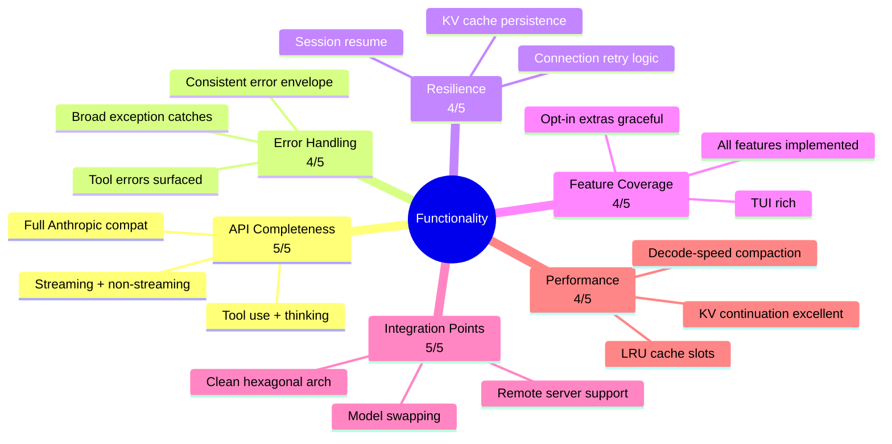
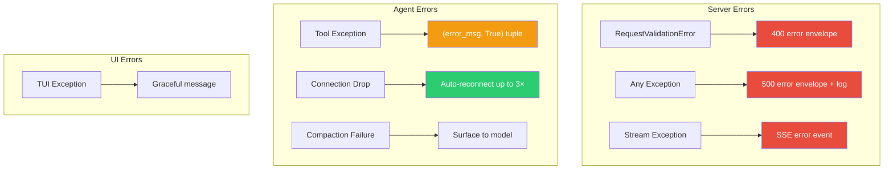
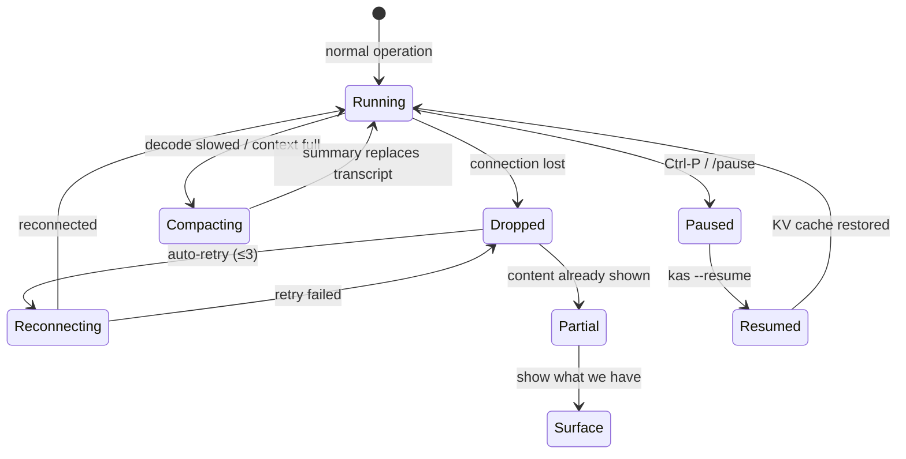
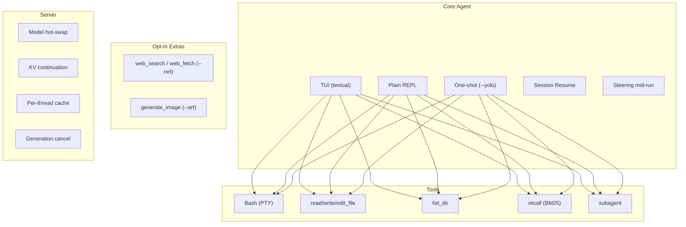
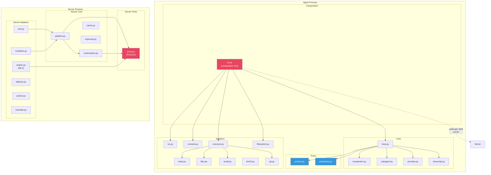
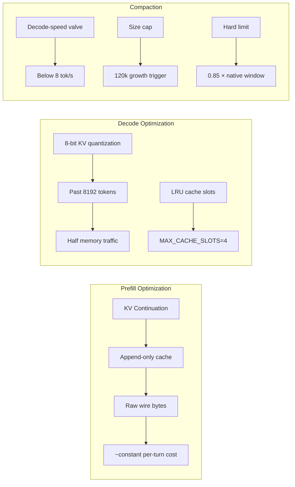

# ⚙️ Functionality Assessment

> Applied to **kas** v0.1.0 — the local agentic shell with MLX inference server.
> Framework criteria from [REVIEW-FRAMEWORK.md](./REVIEW-FRAMEWORK.md#3-functionality-dimension).

---

## Executive Summary



**Overall Functionality Score: 4.3 / 5.0 — Good (bordering on Excellent)**

The kas codebase is remarkably complete for a v0.1.0 project. The Anthropic API
compatibility is thorough, the continuation/KV-cache system is sophisticated,
and the resilience mechanisms (reconnection, compaction, session resume) are
well-engineered. The main gap is around edge-case error handling in the agent
loop and some unbounded resource usage.

---

## 1. API Completeness — Score: 5/5

### Coverage Matrix

```mermaid
gantt
    title Anthropic Messages API Coverage
    dateFormat X
    axisFormat %s
    section Core
    POST /v1/messages (stream)    :0, 5
    POST /v1/messages (non-stream) :0, 5
    GET /v1/models                 :0, 5
    section Extended
    POST /v1/models/select         :0, 4
    POST /v1/cancel                :0, 5
    GET /v1/stats                  :0, 4
    section Events
    message_start/stop             :0, 5
    content_block_start/delta/stop :0, 5
    thinking_delta                 :0, 5
    input_json_delta               :0, 5
    ping (with _stats)             :0, 5
```



### Findings

**✅ Strengths:**

1. **Full Anthropic SDK compatibility** — `tests/test_api.py` proves that the
   official `anthropic.Anthropic` SDK connects and works unmodified. Both
   streaming and non-streaming paths are tested.

2. **Complete event lifecycle** — The SSE adapter (`server/adapters/http/sse.py`)
   implements the full Anthropic event sequence:
   - `message_start` → `content_block_start` → `content_block_delta` (×N)
     → `content_block_stop` → `message_delta` → `message_stop`

3. **Thinking (extended thinking) support** — The `thinking_delta` event type
   is properly emitted, and the `thinking` block is included in the final
   message. The `thinking_enabled` property on `MessagesRequest` correctly
   parses both `adaptive` and `enabled` types.

4. **Tool use wire format** — `input_json_delta` with full JSON payload is
   properly streamed. The SDK's accumulator correctly rebuilds tool calls.

5. **Custom extensions** — The `ping` event carries `_stats` with live progress
   (phase, tokens, tok/s, elapsed) for the TUI status bar. This is a clean
   extension that the Anthropic SDK ignores.

**✅ No significant gaps.** The API surface is complete for the agentic use case.

### Test Evidence

```python
# tests/test_api.py — streaming path verified with official SDK
async with client.messages.stream(**kwargs) as stream:
    deltas = [t async for t in stream.text_stream]
    final = await stream.get_final_message()
assert "".join(deltas).strip() == "Let me check."
assert final.stop_reason == "tool_use"
```

---

## 2. Error Handling — Score: 4/5

### Error Flow



### Findings

**✅ Strengths:**

1. **Consistent error envelope** — `server/app.py:error_response()` wraps all
   errors in the Anthropic error format:
   ```python
   {"type": "error", "error": {"type": err_type, "message": message}}
   ```

2. **Two-tier exception handling on the server** — `RequestValidationError`
   gets a 400 handler, while all other exceptions get a 500 handler with
   `log.exception()` for debugging.

3. **SSE stream safety** — `stream_safe()` wraps the streaming generator so
   server-side failures become an SSE error event instead of an aborted HTTP
   response (which the SDK can't parse).

4. **Tool error surfacing** — `executor.py:run()` catches all exceptions and
   returns `(f"{type(exc).__name__}: {exc}", True)`, so the model sees the
   error and can recover.

5. **Connection resilience** — `agent/core/loop.py` catches `APITimeoutError`,
   `APIConnectionError`, `httpx.TimeoutException`, and `httpx.RemoteProtocolError`
   with up to 3 auto-reconnects.

**⚠️ Gaps:**

1. **Broad `except BaseException` in engine worker** — `engine.py:_worker()`
   catches `BaseException` (including `KeyboardInterrupt`, `SystemExit`) which
   can mask shutdown signals.

   ```python
   # engine.py
   except BaseException as exc:  # propagate to the consumer
       out_q.put(("error", exc))
   ```

2. **Silent exception swallowing** — Several places use bare `except Exception`
   with `pass` or minimal logging:
   - `server/app.py` KV rehydrate: `except Exception: log.info(...)`
   - `engine.py` model loading: catches into `_load_error`
   - `executor.py` git ready: `except Exception: pass`

   These could hide real problems during debugging.

3. **No structured error types** — Errors are always returned as
   `(string, bool)` tuples. There's no distinction between "retryable" and
   "fatal" errors at the tool layer.

### Recommendations

- Use `except Exception` instead of `except BaseException` in the engine
  worker (let `KeyboardInterrupt` propagate for clean shutdown).
- Define a `ToolError` exception class with subtypes (retryable, fatal, etc.)
  instead of `(str, bool)` tuples.
- Add structured logging (JSON) for production debugging.

---

## 3. Resilience & Recovery — Score: 4/5

### Recovery Mechanisms



### Findings

**✅ Strengths:**

1. **Connection retry with partial recovery** — `agent/core/loop.py` maintains
   a `partial` buffer of already-shown content. If reconnection fails after
   content was shown, the partial response is surfaced instead of silently lost.

2. **KV cache persistence** — `server/core/kvpersist.py` saves incremental
   delta files (`0000.safetensors`, `0001.safetensors`, …) with atomic
   writes (`.tmp` → rename). On resume, deltas are replayed in sequence.

3. **Session resume** — `agent/adapters/storage/filesystem.py` stores the full
   transcript as JSON. `--resume` restores both the transcript and the KV cache.

4. **Compaction as a safety valve** — `agent/core/compaction.py` prevents
   context overflow with a hard limit (0.85 × native window) and a soft
   decode-speed trigger.

5. **Pause/resume with state preservation** — `Ctrl-P` saves the session and
   exits cleanly. `--resume` picks it back up with the KV cache warm.

**⚠️ Gaps:**

1. **KV rehydration is best-effort** — `server/app.py` wraps the rehydrate
   call in a try/except that silently logs on failure. If the persisted KV
   cache is corrupted, the user gets a cold prefill with no indication.

2. **No corruption detection** — `kvpersist.py:read_json()` returns `None` for
   corrupt files. The caller may proceed with stale/missing state.

3. **Reconnect limit is hard-coded** — The `reconnects >= 3` limit in the loop
   is not configurable. For flaky networks, this might be too aggressive.

### Recommendations

- Add a KV cache integrity check (e.g., hash verification) on rehydration.
- Make the reconnect limit configurable (`--max-retries` or env var).
- Surface rehydration failures to the TUI ("KV cache restored" / "cold start").

---

## 4. Feature Coverage — Score: 4/5

### Feature Map



### Findings

**✅ Strengths:**

1. **All README features implemented** — Every feature listed in the README
   has corresponding code:
   - TUI with three panels (textual)
   - Steering while working (steers inject at next tool boundary)
   - Pause/resume with `--resume`
   - Subagents with round budget
   - Context window management (`/ctx`)
   - Ambient fx bar, themes
   - Slash commands with tab-complete

2. **Rich TUI** — `agent/tui.py` (1538 lines) is a fully-featured terminal UI
   with theming, subagent views, status bar, and multiline paste support.

3. **Opt-in extras degrade gracefully** — Web tools and image generation both
   return helpful install hints when their backends are absent.

4. **Subagent implementation** — `agent/core/subagent.py` creates a fresh
   context window for delegated tasks. The parent sizes the round budget.

**⚠️ Gaps:**

1. **`--checkpoint` only commits on mutating tools** — The per-turn git commits
   only trigger when `mutated=True`. Pure read operations don't create checkpoints,
   which could lose context on crash.

2. **No undo/rollback** — `write_file` and `edit_file` are destructive. While
   git checkpoints help, there's no in-agent undo mechanism.

3. **`--plain` mode is minimal** — The plain REPL (`--plain`) lacks the TUI's
   steering, theming, and subagent views. It works but is a stripped-down
   experience.

### Recommendations

- Consider checkpointing every turn (not just mutating ones) for crash safety.
- Add a `/undo` or `/rollback` command for the last tool action.
- Enhance `--plain` mode with at least basic steering support.

---

## 5. Integration Points — Score: 5/5

### Architecture Boundaries



### Findings

**✅ Strengths:**

1. **Clean hexagonal architecture** — Both the agent and server follow the
   ports/adapters pattern:
   - **Agent**: `ports/ui.py` and `ports/tools.py` define the interfaces;
     `tui.py`, `console.py`, `executor.py` are adapters.
   - **Server**: `ports.py` defines `EngineLike` and `DialectLike` protocols;
     `engine.py` is the driven adapter.

2. **Core is dependency-free** — `agent/core/loop.py` depends only on ports,
   prompts, toolspecs, and compaction/transcript helpers. It never imports a
   concrete UI or engine.

3. **Server core is testable** — `continuation.py`, `cache.py`, `kvpersist.py`,
   and `parser.py` are pure functions/classes with no MLX dependency. All have
   unit tests that run without a model.

4. **Remote server support** — `--base-url` lets the agent connect to any
   Anthropic-compatible server (remote or local). The agent is fully portable
   without GPU/RAM needs.

5. **Model hot-swap** — `POST /v1/models/select` allows runtime model changes.
   The continuation memos are cleared on swap (model-specific).

**✅ No significant gaps.** The architecture is exemplary.

---

## 6. Performance — Score: 4/5

### Performance Features



### Findings

**✅ Strengths:**

1. **Raw-stream continuation** — This is the standout feature. By appending
   tool results as wire-format bytes directly to the cached token stream,
   the server avoids full re-prefill. The `continuation.py` logic with
   `echo_matches` verification is clever and thoroughly tested.

2. **KV cache quantization** — `engine.py` quantizes KV cache to 8-bit past
   8192 tokens (`KAS_KV_BITS=8`, `KAS_KV_START=8192`). This halves memory
   traffic for long contexts with near-lossless quality.

3. **LRU-bounded cache slots** — `MAX_CACHE_SLOTS=4` prevents unbounded growth.
   LRU eviction frees cache for new threads.

4. **Decode-speed compaction valve** — `COMPACT_TPS=8.0` triggers compaction
   when smoothed decode drops below 8 tok/s. This is the real symptom, not
   an arbitrary token count.

5. **Weight pinning** — `mx.set_wired_limit()` prevents macOS from paging
   model weights under memory pressure.

**⚠️ Gaps:**

1. **No prefill progress feedback during continuation** — When continuation
   hits, the prefill is near-instant. But the client still sees the same
   stream of pings. The TUI could differentiate "continuation hit" from
   "cold prefill" for better UX.

2. **`tps_window` deque is unbounded in time** — `deque(maxlen=4)` keeps the
   last 4 samples, but if the agent is idle for hours, stale samples could
   trigger unnecessary compaction.

3. **No benchmarking infrastructure** — There's no automated benchmark to
   track tok/s regression across changes.

### Recommendations

- Add a `--bench` mode that runs a synthetic workload and reports tok/s.
- Add a time-to-live on tps_window samples (discard samples older than 1 hour).
- Surface continuation hits to the TUI ("cache hit: 42k tokens reused").

---

## Functionality Scorecard

| Criterion | Score | Status |
|-----------|-------|--------|
| API Completeness | 5 | ✅ Excellent — full Anthropic compat |
| Error Handling | 4 | ✅ Good — consistent envelope, broad catches |
| Resilience & Recovery | 4 | ✅ Good — retry, resume, compaction |
| Feature Coverage | 4 | ✅ Good — all features implemented |
| Integration Points | 5 | ✅ Excellent — clean hexagonal arch |
| Performance | 4 | ✅ Good — continuation + quantization |
| **Weighted Average** | **4.3** | **Good → Excellent** |
